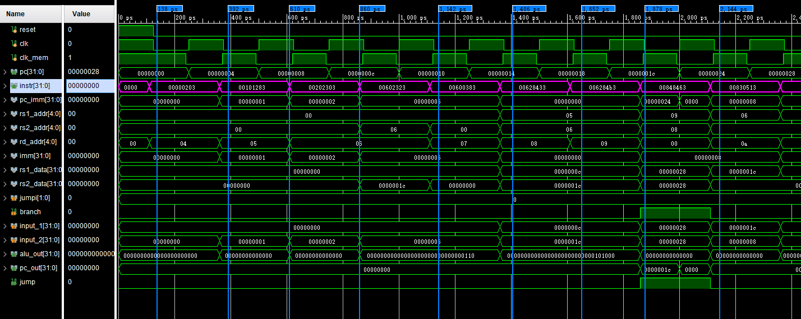

## 性能指标：

我们的cpu有两种周期，一种是普通取指周期即clk，另一种是取数据周期clk_mem。

### 周期与频率
经过不断的调试，我们能够达到的最短取指周期是0.25ns，即我们的cpu最高频率可以达到4MHz。

### 运作路线
我们的cpu最长运作路线可以看作如下：
PC->取指令->编码->取寄存器->计算->存取数据->存寄存器。 
为了加快cpu的工作速度，我们设置了一个clk_mem来控制数据的存储。
我们设置了在clk_mem的上升边沿进行存数据，在下降边沿进行存寄存器，clk_mem的上升边沿与clk的上升边沿有一定的延时。
周期控制详见test_clk.v

### CPI
作为单周期cpu来讲，我们的cpi为1

## 实现指令
为了能够成功适应编译出来的c代码，我们一共实现了21条指令，具体如下：

| type | instr | discription                |
| :--- | :---- | :------------------------- |
| R    | add   | rd = rs1 + rs2             |
| R    | sub   | rd = rs1 - rs2             |
| R    | sll   | rd = rs1 << rs2            |
| R    | sra   |                            |
| R    | add   | rd = r1 + imm              |
| I    | andi  |                            |
| I    | slti  |                            |
| IL   | lw    | rd=M[rs1+imm][0:31]        |
| IL   | lb    | rd=M[rs1+imm][0:7]         |
| IL   | lbu   |                            |
| S    | sw    | M[rs1+imm][0:31]=rs2[0:31] |
| S    | sb    | M[rs1+imm][0:7]=rs2[0:7]   |
| B    | beq   | if(rs1==rs2) pc=pc+imm     |
| B    | bne   |                            |
| B    | blt   | if(rs1`<`rs2) pc=pc+imm    |
| B    | bltu  |                            |
| B    | bgeu  |                            | 
| U    | auipc |                            |
| U    | lui   |                            |
| J    | jal   | rd=pc+4;pc = pc+imm        |
| JR   | jalr  |                            |

## 波形验证

### 数据存储器：
我们使用了双端口数据来存储
我们设置了一些特殊的数据来验证lb和lh能否正常运行。
|地址|数据|
|:-|:-|
|0x00|00000000000000000000011100000100,|
|0x04|00000000000001110000000000001100,|
|0x08|00000000000000000000000000011100,|
|0x0c|00000000000000000000000000111100;|

    // IL
    000000000000 00000 000 00100 0000011, //从寄存器0地址偏移零个字节 加载字节 到寄存器4
    // 寄存器4： 00000100
    000000000100 00000 001 00101 0000011, //从寄存器0地址偏移四个字节 加载半字 到寄存器5
    // 寄存器5： 0000000000001100
    000000001000 00000 010 00110 0000011, //从寄存器0地址偏移八个字节 加载半字 到寄存器6
    // 寄存器6：  00000000000000000000000000111100

    // S
    0000000 00110 00000 010 01100 0100011, //将寄存器6的一个字存进寄存器0偏移12个字节的地址
    //地址6：00000000000000000000000000111100

    // IL
    000000001100 00000 000 00111 0000011, //从寄存器0地址偏移12个字节 加载字节 到寄存器7
    // 寄存器7： 00000000000000000000000000111100

    // R
    0000000 00110 00101 000 01000 0110011, //将寄存器5的值加寄存器6的值存进寄存器8中
    //000000000000 00000 001 00101 0000011 +
    //000000001000 00000 010 00110 0000011 =
    //000000001000 00000 011 01011 0000110

    0000000 00110 00101 000 01001 0110011, //将寄存器5的值加寄存器6的值存进寄存器9中

    // B
    0000000 01000 01001 000 01000 1100011, //判断寄存器8和寄存器9的值，跳转至下2条指令

    // I
    000000001100 00110 000 01010 0010011,//将寄存器6的数加1100存进寄存器10中
    000000001000 00110 000 01010 0010011,//将寄存器6的数加1000存进寄存器10中

从仿真图中我们可以看到，每一条标记对应一个指令，我们一条条讲解。
开始时是reset信号，pc为ffff ffff ffff fffc,reset为0时pc+4，此时pc为0开始执行指令。
第一条：
pc值为0时读出的指令是0203，可以确认取指令的过程没有问题。
寄存器rs1的地址是00，rd的地址是04，同时立即数是0，我们可以确认部分指令译码没有问题。
经过alu运算后alu输出地址00，去datamem取值，可以看到read_data值在为04符合我们的预期，我们可以确认读字节过程没有问题。

第二条：
从rs1的数据偏移4字节，我们可以看到alu输出的地址为04，去04地址取值，可以看到在一段时间后read_data稳定为1100，符合预期，取半字也没有问题。

第三条：
同样的，我们可以发现read_data为11100，取字也没有问题。

第四条：
我们将寄存器6的一个字存进寄存器0偏移12个字节的地址，w_data的数据为11100，在写入之前的流程一切正常

第五条：
从从寄存器0偏移12个字节取一个字的数据，我们可以发现读出的数据为11100，我们可以确认第四条成功存入了数据。

第六条：
将寄存器5的值加寄存器6的值存进寄存器8中，即1100+11100，预期输出为101000，即0x28，我们可以看到alu的输出结果为0028，可以证明alu运算部分没有问题。

第七条：
与第六条一致，存进寄存器9中。

第八条：
比较寄存器8和9的值，若一致则跳转至下两条指令。
我们可以发现input_1和input_2输入的值都是28，这也验证了上面两条的寄存器写回步骤是没有问题的，同时jump变成了1，这能说明alu成功做出了比较判断。

第十条：
我们可以发现此时pc值由上一条的1c变成了24，说明跳转成功了，这也验证了cpu的跳转功能是正常的。
这是一条addi指令，我们可以发现imm的值是1000，这说明取的指令是正确的。
该操作要求寄存器6的值加立即数并写回寄存器10中。
我们可以观察到alu的结果是0024，这说明立即数加法也是正常的。

综上，我们手写的机器码验证全部通过，前仿正常。