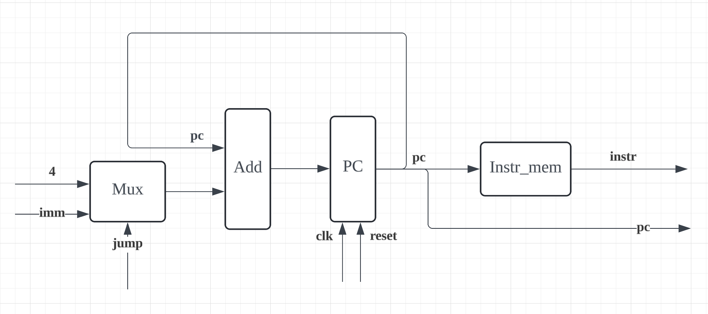

## PC 接口说明

### PC 示意图



### 端口

```v
module pc_reg (
    input clk,
    input reset,

    input jump,
    input [31:0] pc_imm,

    output [31:0] instr
);
```

| 类型   | 端口   | 位宽 | 功能                     |
| :----- | :----- | :--- | :----------------------- |
| input  |        |      |                          |
|        | clk    | 1    | 时钟信号                 |
|        | reset  | 1    | 重置信号                 |
|        | jump   | 1    | 跳转信号                 |
|        | pc_imm | 32   | pc 跳转立即数            |
| output |        |      |                          |
|        | instr  | 32   | 从指令存储器中读出的指令 |

### 功能描述：

若 jump 信号为 1 则 pc=pc+pc_imm 进行跳转，否则 pc=pc+4。

当 pc 值确定后去指令存储器中取出指令。
